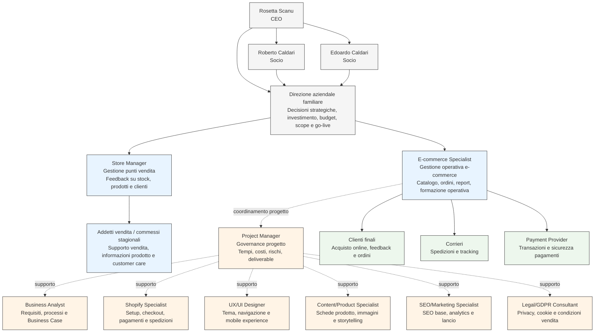

# Contesto e dominio

## 1. Descrizione di Surya Tesori Accessori

Surya Tesori Accessori è un brand italiano che crea gioielli e accessori moda pensati per esprimere personalità, carattere e unicità.

Ogni collezione nasce da una ricerca continua di forme, materiali e dettagli, con l’obiettivo di accompagnare ogni donna nei diversi momenti della quotidianità. Le creazioni sono versatili e distintive, ideate per adattarsi a stili diversi e valorizzare ogni identità.

Da oltre 20 anni l’azienda viaggia il mondo alla ricerca di ispirazioni, tradizioni e materiali, unendo culture lontane in uno stile contemporaneo e autentico. La storia del brand nasce dall’incontro tra passione, esperienza e ricerca dell’eccellenza.

Ogni creazione riflette lavorazioni artigianali, cura manuale e attenzione ai materiali. Il valore di Surya non è soltanto nel prodotto, ma anche nel racconto che accompagna ogni pezzo.

## 2. Settore gioielli e accessori moda artigianali

Il settore degli accessori moda artigianali presenta alcune caratteristiche rilevanti:

- Forte importanza di immagini e dettagli visivi;
- Necessità di raccontare materiali, lavorazioni e ispirazioni;
- Collezioni soggette a stagionalità e trend;
- Valore percepito legato a unicità e artigianalità;
- Rilevanza della fiducia nel processo di acquisto online;
- Necessità di policy chiare su spedizioni e resi;
- Ruolo importante dei social media nella scoperta del brand.

Nel negozio fisico il cliente può osservare, toccare e provare il prodotto. Online queste componenti devono essere sostituite da fotografie curate, descrizioni complete, navigazione semplice e checkout affidabile.

## 3. Posizionamento del brand

Surya si posiziona come brand artigianale, distintivo e femminile. Non compete principalmente sul prezzo, ma su:

- Unicità;
- Selezione dei materiali;
- Cura del dettaglio;
- Ispirazioni internazionali;
- Lavorazione manuale;
- Autenticità del racconto;
- Capacità di valorizzare l’identità personale.

Il sito e-commerce deve quindi evitare un’impostazione solo transazionale. Deve vendere, ma anche trasferire online la sensibilità del brand.

## 4. Store fisici

Surya ha tre store fisici in Italia:

| Store | Ruolo nel progetto |
|---|---|
| Riccione | Punto vendita con forte visibilità e potenziale clientela turistica |
| Misano | Store utile per feedback operativo su prodotti e disponibilità |
| Cattolica | Store principale e punto vendita rilevante per presidio locale e relazione cliente |

Gli store fisici restano centrali. L’e-commerce non li sostituisce, ma amplia la relazione con clienti che non vivono nelle località presidiate o che desiderano riacquistare online dopo aver conosciuto il brand in negozio.

## 5. Motivazioni dell’espansione online

Surya valuta l’e-commerce per:

- Aumentare la copertura geografica;
- Aumentare la clientela;
- Valorizzare online lo storytelling artigianale;
- Ampliare il brand tramite uno store digitale;
- Raccogliere dati commerciali;
- Migliorare gestione catalogo, ordini e campagne;
- Verificare la convenienza economica del canale online;
- Costruire una base per future evoluzioni multi-canale.

## 6. Attori principali

Preciso che essendo un'impresa di medie dimensioni, i soggetti coinvolti possono ricoprire più ruoli.

| Attore | Interesse | Responsabilità |
|---|---|---|
| Proprietà Surya | Valutare investimento e strategia | Approvazione budget, scope e go-live |
| E-commerce specialist | Gestione operativa e-commerce | Formazione, catalogo, ordini, report |
| Store manager | Conoscenza prodotti e clienti | Feedback su stock e prodotti |
| Addetti vendita | Supporto informale su prodotto | Informazioni prodotto e customer care |
| Project Manager | Governance progetto | Tempi, costi, rischi, deliverable |
| Business Analyst | Analisi requisiti e processi | Business Case e requisiti |
| Shopify Specialist | Configurazione piattaforma | Setup, checkout, pagamenti, spedizioni |
| UX/UI Designer | Coerenza visiva | Tema, navigazione, mobile |
| Content/Product Specialist | Contenuti prodotto | Schede, immagini, storytelling |
| SEO/Marketing Specialist | Visibilità e misurazione | SEO base, analytics, lancio |
| Legal/GDPR Consultant | Compliance | Privacy, cookie, condizioni vendita |
| Clienti finali | Acquisto online | Feedback e ordini |
| Corrieri | Consegna ordini | Spedizioni e tracking |
| Payment provider | Pagamenti | Transazioni e sicurezza |

## 7. Organigramma aziendale
L’organigramma aziendale di Surya Tesori Accessori evidenzia una struttura familiare e snella. Al vertice si trova la CEO **Rosetta Scanu**. La governance è condivisa con **Roberto Caldari** e con il figlio **Edoardo Caldari**.

Dal punto di vista operativo, l’impresa si basa su una struttura retail composta da store manager e addetti vendita, il cui numero può variare in base alla stagionalità. Nel progetto e-commerce, la figura dell’**E-commerce Specialist**, raffigurata da Edoardo, assume un ruolo centrale nella gestione operativa del canale online, in particolare per catalogo, ordini, report e coordinamento con i fornitori esterni.

## 8. Glossario del dominio

| Termine | Definizione |
|---|---|
| Collezione | Insieme di prodotti accomunati da tema, stile, stagione o materiale |
| Pezzo artigianale | Creazione realizzata a mano, con valore legato a unicità e cura |
| Variante | Differenza di colore, misura, materiale o finitura |
| SKU | Codice identificativo di prodotto o variante |
| Stock | Quantità disponibile per la vendita |
| Lookbook | Raccolta visuale di prodotti indossati o ambientati |
| Scheda prodotto | Pagina con immagini, descrizione, prezzo, varianti e CTA |
| Checkout | Processo di completamento ordine e pagamento |
| Fulfillment | Preparazione, imballaggio e spedizione ordine |
| Reso | Restituzione prodotto secondo condizioni definite |
| Multi-Canalità | Integrazione tra store fisici e canale digitale |
| Conversion rate | Percentuale di visitatori che acquistano |
| Carrello medio | Valore medio degli ordini |
| MVP | Versione iniziale funzionante con funzionalità essenziali |
| Soft launch | Lancio controllato prima della pubblicazione pubblica |
| Analytics | Raccolta e analisi dei dati di traffico e vendita |

## 9. Catena del valore di Porter applicata a un prodotto Surya

Per comprendere meglio il dominio operativo di Surya Tesori Accessori, è utile rappresentare il percorso attraverso cui un prodotto artigianale entra nell’assortimento aziendale e arriva alla vendita negli store fisici o, in prospettiva, nel canale e-commerce.

La catena del valore di Porter permette di distinguere le attività primarie che generano valore per il cliente finale. Nel caso Surya, il valore non nasce solo dalla vendita del prodotto, ma dall’intero processo di ricerca, selezione, relazione con i fornitori, cura artigianale, importazione, presentazione e racconto del prodotto.

```mermaid
flowchart LR

    A["Scelta del fornitore<br/><br/>Ricerca di artigiani, produttori e partner coerenti con identità Surya"]
    B["Contatto fornitore<br/><br/>Primo confronto su materiali, stile, disponibilità e affidabilità"]
    C["Accordo fornitore<br/><br/>Definizione condizioni, tempi, quantità, prezzi e modalità di consegna"]
    D["Selezione prodotti fatti a mano<br/><br/>Valutazione estetica, qualità, unicità e coerenza con le collezioni"]
    E["Importazione prodotti<br/><br/>Gestione logistica, documenti, ricezione e controllo merce"]
    F["Vendita nello store<br/><br/>Esposizione, racconto al cliente, vendita assistita e raccolta feedback"]

    A --> B --> C --> D --> E --> F

    classDef ricerca fill:#eef5ff,stroke:#2b5797,stroke-width:1px,color:#000;
    classDef relazione fill:#fff4e6,stroke:#b36b00,stroke-width:1px,color:#000;
    classDef valore fill:#edf7ed,stroke:#2e7d32,stroke-width:1px,color:#000;
    classDef vendita fill:#f8eafa,stroke:#8e24aa,stroke-width:1px,color:#000;

    class A ricerca;
    class B,C relazione;
    class D,E valore;
    class F vendita;
```

