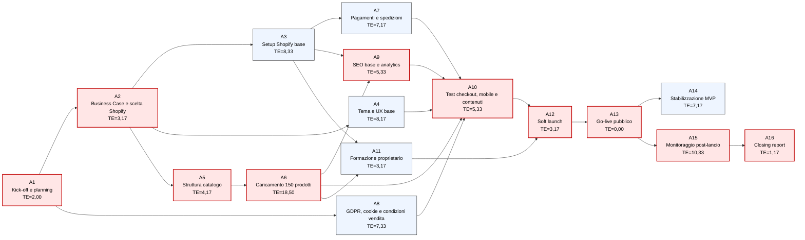

# Gantt e Project Network

## 1. Premessa

La pianificazione considera:

- Avvio operativo: 1 aprile 2026;
- Go-live pubblico: 1 giugno 2026;
- Durata MVP: 10 settimane, con go-live in settimana 9 e stabilizzazione iniziale fino al 10 giugno;
- Monitoraggio post-lancio: 1 - 15 giugno 2026.

Il progetto è pianificato con attività parzialmente sovrapposte per rispettare tempi e budget.

## 2. Milestone

| ID | Milestone | Data |
|---|---|---|
| M1 | POS approvato | 31 marzo 2026 |
| M2 | Avvio progetto | 1 aprile 2026 |
| M3 | Shopify confermato | 7 aprile 2026 |
| M4 | Setup Shopify base completato | 21 aprile 2026 |
| M5 | Pagamenti/spedizioni configurati | 8 maggio 2026 |
| M6 | Catalogo MVP completato | 15 maggio 2026 |
| M7 | Test checkout completati | 22 maggio 2026 |
| M8 | Formazione completata | 22 maggio 2026 |
| M9 | Soft launch | 25 maggio 2026 |
| M10 | Go-live pubblico | 1 giugno 2026 |
| M11 | Stabilizzazione MVP completata | 10 giugno 2026 |
| M12 | Report post-lancio | 15 giugno 2026 |

## 3. Attività, durata e dipendenze

| ID | Attività | Periodo | Durata | Dipendenze |
|---|---|---|---:|---|
| A1 | Kick-off e planning sintetico | 1 - 7 aprile | 1 settimana | POS |
| A2 | Business Case e scelta Shopify | 1 - 7 aprile | 1 settimana | A1 |
| A3 | Setup Shopify base | 8 - 21 aprile | 2 settimane | A2 |
| A4 | Scelta tema e UX base | 8 - 21 aprile | 2 settimane | A2 |
| A5 | Struttura catalogo | 8 - 14 aprile | 1 settimana | A1 |
| A6 | Preparazione/caricamento 150 prodotti | 15 aprile - 15 maggio | 4,5 settimane | A5 |
| A7 | Pagamenti e spedizioni | 22 aprile - 8 maggio | 2,5 settimane | A3 |
| A8 | GDPR, cookie e condizioni vendita | 22 aprile - 8 maggio | 2,5 settimane | A1 |
| A9 | SEO base e analytics | 6 - 15 maggio | 1,5 settimane | A3, A6 parziale |
| A10 | Test checkout, mobile e contenuti | 11 - 22 maggio | 2 settimane | A6, A7, A8 |
| A11 | Formazione proprietario | 18 - 22 maggio | 1 settimana | A3, A6 parziale |
| A12 | Soft launch | 25 - 29 maggio | 1 settimana | A10, A11 |
| A13 | Go-live pubblico | 1 giugno | 1 giorno | A12 |
| A14 | Stabilizzazione MVP | 1 - 10 giugno | 1,5 settimane | A13 |
| A15 | Monitoraggio post-lancio | 1 - 15 giugno | 2 settimane | A13 |
| A16 | Closing report | 15 giugno | 1 giorno | A15 |

## 4. Diagramma Gantt

~~~mermaid
gantt
    title Gantt progetto Surya Shop - MVP Shopify
    dateFormat  YYYY-MM-DD
    axisFormat  %d/%m

    section Initiating e Planning
    POS approvato                         :milestone, m1, 2026-03-31, 1d
    Kick-off e planning                   :crit, a1, 2026-04-01, 7d
    Business Case e scelta Shopify        :crit, a2, 2026-04-01, 7d

    section Setup Shopify
    Setup Shopify base                    :crit, a3, 2026-04-08, 14d
    Tema e UX base                        :a4, 2026-04-08, 14d
    Struttura catalogo                    :crit, a5, 2026-04-08, 7d

    section Catalogo e operativita
    Caricamento 150 prodotti              :crit, a6, 2026-04-15, 31d
    Pagamenti e spedizioni                :crit, a7, 2026-04-22, 17d
    GDPR cookie condizioni vendita        :a8, 2026-04-22, 17d
    SEO base e analytics                  :a9, 2026-05-06, 10d

    section Test e formazione
    Test checkout mobile contenuti        :crit, a10, 2026-05-11, 12d
    Formazione proprietario               :crit, a11, 2026-05-18, 5d
    Soft launch                           :crit, a12, 2026-05-25, 5d

    section Lancio e monitoraggio
    Go-live pubblico                      :milestone, crit, m10, 2026-06-01, 1d
    Stabilizzazione MVP                   :crit, a14, 2026-06-01, 10d
    Monitoraggio post-lancio              :a15, 2026-06-01, 15d
    Report post-lancio                    :milestone, m12, 2026-06-15, 1d
~~~

## 5. Critical path senza interdipendenze

Il percorso critico realistico deve considerare anche le interdipendenze tra le attività.

Per questo motivo viene fornito il diagramma di PERT nella sezione sottostante.

## 6. Dipendenze principali

### Catalogo

Il catalogo è critico perché 150 prodotti richiedono immagini, descrizioni, prezzi e varianti. Se il catalogo non è completo, il sito può essere tecnicamente pronto ma non pubblicabile.

### Pagamenti e spedizioni

Checkout, pagamenti e spedizioni devono essere testati prima del soft launch. Considerando il tempo di apertura di un conto bancario nuovo.

### GDPR e policy

Privacy, cookie, resi e condizioni vendita sono condizioni di go-live.

### Formazione

Poiché viene formata una sola persona, la formazione è una dipendenza critica. Senza autonomia minima del E-commerce specialist, il progetto non può essere considerato completato.

## 7. Analisi PERT e calcolo del percorso critico

## 7.1 Premessa metodologica

Per rafforzare la pianificazione temporale del progetto è stata applicata una logica PERT, utile per rappresentare le **dipendenze tra attività e calcolare il percorso critico**.

Il PERT viene utilizzato con una stima a tre punti:

\[
TE = \frac{O + 4M + P}{6}
\]

dove:

- **O** = durata ottimistica;
- **M** = durata più probabile;
- **P** = durata pessimistica;
- **TE** = durata attesa.

Le durate sono espresse in **giorni lavorativi equivalenti**. Il calcolo è coerente con la pianificazione complessiva del progetto, che prevede avvio il **1 aprile 2026**, go-live il **1 giugno 2026** e monitoraggio post-lancio fino al **15 giugno 2026**.

## 7.2 Tabella PERT delle attività

| ID | Attività | Predecessori | O | M | P | TE |
|---|---|---|---:|---:|---:|---:|
| A1 | Kick-off e planning sintetico | - | 1 | 2 | 3 | 2,00 |
| A2 | Business Case e scelta Shopify | A1 | 2 | 3 | 5 | 3,17 |
| A3 | Setup Shopify base | A2 | 6 | 8 | 12 | 8,33 |
| A4 | Scelta tema e UX base | A2 | 5 | 8 | 12 | 8,17 |
| A5 | Struttura catalogo | A2 | 3 | 4 | 6 | 4,17 |
| A6 | Preparazione/caricamento 150 prodotti | A5 | 15 | 18 | 24 | 18,50 |
| A7 | Pagamenti e spedizioni | A3 | 5 | 7 | 10 | 7,17 |
| A8 | GDPR, cookie e condizioni vendita | A1 | 5 | 7 | 11 | 7,33 |
| A9 | SEO base e analytics | A3, A6 | 4 | 5 | 8 | 5,33 |
| A10 | Test checkout, mobile e contenuti | A4, A6, A7, A8, A9 | 4 | 5 | 8 | 5,33 |
| A11 | Formazione proprietario | A3, A6 | 2 | 3 | 5 | 3,17 |
| A12 | Soft launch | A10, A11 | 2 | 3 | 5 | 3,17 |
| A13 | Go-live pubblico | A12 | 0 | 0 | 0 | 0,00 |
| A14 | Stabilizzazione MVP | A13 | 5 | 7 | 10 | 7,17 |
| A15 | Monitoraggio post-lancio | A13 | 8 | 10 | 14 | 10,33 |
| A16 | Closing report | A15 | 1 | 1 | 2 | 1,17 |

## 7.3 Diagramma PERT

## 7.4 Critical Path

Il percorso critico fino al go-live pubblico è:

A1 → A2 → A5 → A6 → A9 → A10 → A12 → A13

Risultato più veritiero poiché considera anche le interdipendenze tra le attività.

## 7.5 Interpretazione PERT
Il percorso critico evidenzia che il principale vincolo del progetto non è la configurazione tecnica di Shopify, ma la preparazione del catalogo e il completamento delle attività necessarie al test e al go-live.

Le attività più critiche sono:

- A5 - Struttura catalogo: Se la struttura del catalogo non viene definita rapidamente, il caricamento dei 150 prodotti slitta;
- A6 - Preparazione/caricamento 150 prodotti: È l’attività più lunga e delicata. Fotografie, descrizioni, prezzi e varianti devono essere gestiti con disciplina;
- A9 - SEO base e analytics: Dipende dal catalogo e deve essere completata prima dei test finali;
- A10 - Test checkout, mobile e contenuti: È una barriera di qualità prima del soft launch;
- A12 - Soft launch: Serve a validare il sito prima della pubblicazione pubblica;
- A15 - Monitoraggio post-lancio: È critico per il closing complessivo, perché il report finale dipende dalla raccolta dei dati delle prime due settimane.

A15 non appartiene al percorso critico fino al go-live, ma è critica per la chiusura progettuale e per il report finale.