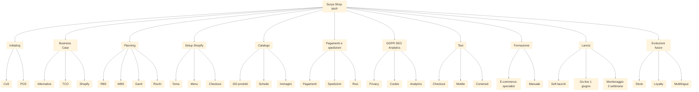

# Work Breakdown Structure - WBS

## 1. Premessa

La WBS scompone il lavoro del progetto Surya Shop in attività gestibili. Le priorità sono classificate con metodo MoSCoW:

- **Must**: indispensabile per il MVP.
- **Should**: importante ma non bloccante.
- **Could**: utile ma rimandabile.
- **Won’t have**: escluso dal MVP.

La WBS è costruita su un progetto con: avvio 1 aprile 2026, go-live 1 giugno 2026, setup/lancio con budget target 10.000 euro.

## 2. WBS gerarchica

### 1. Initiating e scoping

1.1 Analisi stakeholder — Must  
1.2 Meeting di scoping — Must  
1.3 Conditions of Satisfaction — Must  
1.4 POS — Must  

### 2. Business Case e scelta soluzione

2.1 Analisi alternative — Must  
2.2 Analisi do nothing — Must  
2.3 Matrice ponderata — Must  
2.4 TCO stimato — Must  
2.5 Raccomandazione Shopify — Must  

### 3. Planning

3.1 RBS — Must  
3.2 WBS — Must  
3.3 Stime tempi/costi/risorse — Must  
3.4 Gantt — Must  
3.5 Risk Register — Must  
3.6 RASCI — Must  
3.7 Piano comunicazione — Must  
3.8 PDS — Must  

### 4. Setup Shopify

4.1 Configurazione ambiente — Must  
4.2 Scelta tema — Must  
4.3 Adattamento base brand — Must  
4.4 Menu e collezioni — Must  
4.5 Pagine istituzionali — Must  
4.6 Checkout — Must  
4.7 Personalizzazione avanzata tema — Won’t have  

### 5. Catalogo e contenuti

5.1 Struttura catalogo — Must  
5.2 Selezione 150 prodotti — Must  
5.3 Template scheda prodotto — Must  
5.4 Caricamento prodotti — Must  
5.5 Revisione immagini — Must  
5.6 Storytelling essenziale — Should  
5.7 Lookbook avanzato — Could  

### 6. Pagamenti, spedizioni e policy

6.1 Pagamenti — Must  
6.2 Spedizioni Italia — Must  
6.3 Policy resi — Must  
6.4 Condizioni vendita — Must  
6.5 Email transazionali base — Should  
6.6 Vendita internazionale — Won’t have  

### 7. GDPR, SEO e analytics

7.1 Privacy policy — Must  
7.2 Cookie policy/banner — Must  
7.3 SEO base — Must  
7.4 Analytics — Must  
7.5 Search Console — Should  
7.6 SEO editoriale avanzata — Could  

### 8. Test

8.1 Test checkout — Must  
8.2 Test pagamenti — Must  
8.3 Test spedizioni — Must  
8.4 Test mobile — Must  
8.5 Test contenuti — Must  
8.6 Test utenti estesi — Could  

### 9. Formazione

9.1 Manuale sintetico — Must  
9.2 Formazione proprietario — Must  
9.3 Esercitazione catalogo — Must  
9.4 Esercitazione ordini — Must  
9.5 Formazione team esteso — Won’t have  

### 10. Lancio e monitoraggio

10.1 Piano lancio — Must  
10.2 Soft launch — Must  
10.3 Go-live 1 giugno 2026 — Must  
10.4 Monitoraggio 2 settimane — Must  
10.5 Report post-lancio — Must  
10.6 Closing — Must  

### 11. Evoluzioni future

11.1 Integrazione stock fisico — Could  
11.2 Loyalty — Could  
11.3 Multilingua — Could  
11.4 App recensioni — Could  
11.5 Marketplace complementari — Could  

## 3. Tabella WBS

| ID | Attività | Priorità | Deliverable | Responsabile |
|---|---|---|---|---|
| 1.1 | Analisi stakeholder | Must | Mappa stakeholder | PM |
| 1.3 | Conditions of Satisfaction | Must | CoS approvate | PM |
| 1.4 | POS | Must | POS approvato | PM |
| 2.1 | Analisi alternative | Must | Confronto soluzioni | Business Analyst |
| 2.4 | TCO stimato | Must | Stima costi | Business Analyst |
| 2.5 | Raccomandazione Shopify | Must | Decisione motivata | PM |
| 3.1 | RBS | Must | RBS | Business Analyst |
| 3.2 | WBS | Must | WBS | PM |
| 3.4 | Gantt | Must | Piano temporale | PM |
| 3.5 | Risk Register | Must | Registro rischi | PM |
| 4.1 | Configurazione Shopify | Must | Ambiente attivo | Shopify Specialist |
| 4.2 | Scelta tema | Must | Tema selezionato | UX/UI Designer |
| 4.4 | Menu e collezioni | Must | Navigazione | Shopify Specialist |
| 5.2 | Selezione 150 prodotti | Must | Lista prodotti | E-commerce specialist |
| 5.4 | Caricamento prodotti | Must | Catalogo MVP | E-commerce specialist + Content Specialist |
| 5.5 | Revisione immagini | Must | Immagini validate | Content Specialist |
| 6.1 | Pagamenti | Must | Checkout pagamenti | Shopify Specialist |
| 6.2 | Spedizioni Italia | Must | Tariffe attive | Shopify Specialist |
| 6.3 | Policy resi | Must | Policy pubblicata | Legal/GDPR |
| 7.1 | Privacy policy | Must | Documento pubblicato | Legal/GDPR |
| 7.3 | SEO base | Must | Metadata essenziali | Marketing Specialist |
| 7.4 | Analytics | Must | Tracciamento attivo | Marketing Specialist |
| 8.1 | Test checkout | Must | Ordini test | Shopify Specialist |
| 8.4 | Test mobile | Must | Checklist mobile | UX/UI Designer |
| 9.1 | Manuale sintetico | Must | Manuale operativo | PM |
| 9.2 | Formazione proprietario | Must | Sessione completata | Shopify Specialist |
| 10.2 | Soft launch | Must | Feedback interno | PM |
| 10.3 | Go-live | Must | Sito pubblico | E-commerce specialist |
| 10.5 | Report post-lancio | Must | Report 2 settimane | PM |

## 4. Diagramma WBS

